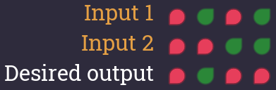

# Second Tick

The given truth table looks as follows:

The output is supposed to be false whenever the first input is false.
We can ensure this property by taking an AND with the first input:

If the first input is true, then the output is supposed to be the complement of the second input.
We therefore negate the second input before connecting it to the AND gate.

