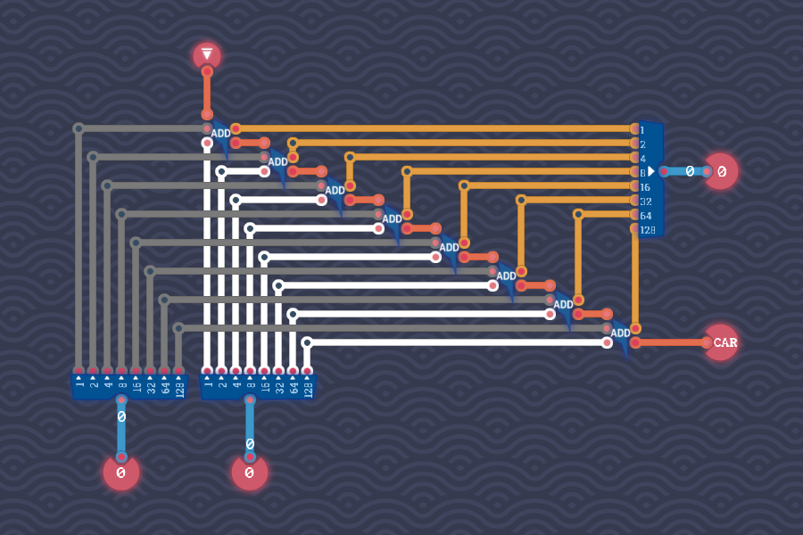

# Adding Bytes

Let $a_1, \dotsc, a_8$ and $b_1, \dotsc, b_8$ be the bits of the input bytes, and let $c_1$ be the additional input carry.

Generally speaking, we will compute the $i$-th bit of the result by adding together the $i$-th bites of the two input bytes and the carry that arose from the computation of the previous bit.

We start by adding together $a_1$, $b_1$ and $c_1$ with a full adder, resulting in a bit $r_1$ and new carry $c_2$.
More generally, if we have computed bites $r_1, \dotsc, r_{i - 1}$ and carries $c_1, \dotsc, c_i$, then we compute $r_i$ and $c_{i + 1}$ by combining $a_i$, $b_i$ and $c_i$ with a full adder:
$$
  (r_i, c_{i + 1}) = \mathtt{Full\text{-}Adder}(a_i, b_i, c_i) \,.
$$
The bits $r_1, \dotsc, r_8$ combine into a single byte, which is the sum of the two input bytes.
The final carry $c_9$ is the additional output carry.

