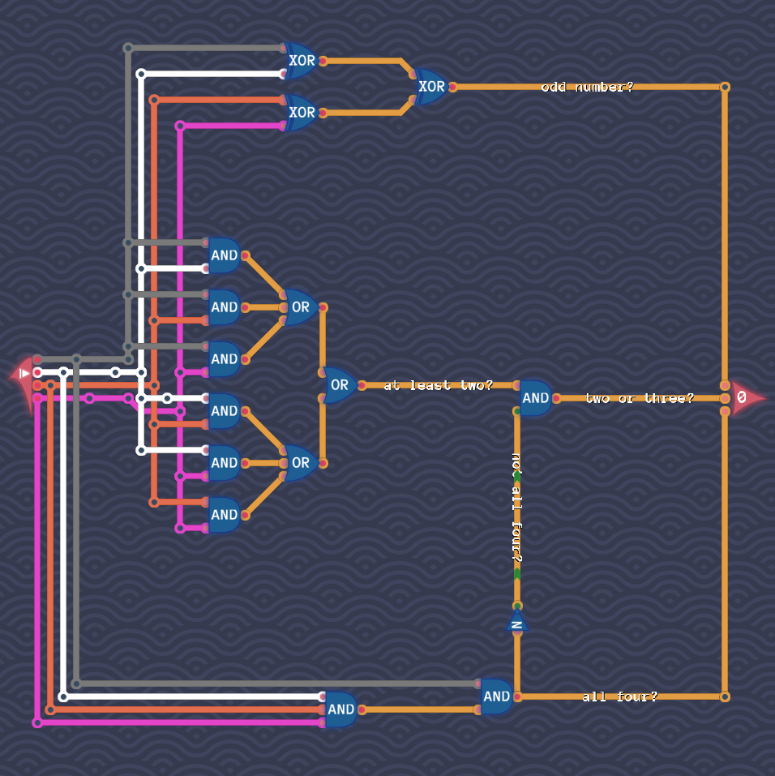

# Counting Signals

We compute the three output bits nearly separately:

- The first output bit is `true` if and only if we have an odd number of `true` input signals.
  We have seen in “Odd Number of Signals” how to determine this output bit.

- The third output bit is `true` if and only if all four input signals are `true`.
  We can check this condition by combining all input signals with AND gates.

- The second output bit is `true` if and only if two or three input signals are `true`.
  We have seen in “Double Trouble” how to determine if at least two signals are `true`, and we subtract from this the possibility of all four being `true`.
  That is, we take the circuit from “Double Trouble” AND combine it with the negation of the third bit.

We arrive altogether at the following circuit:

