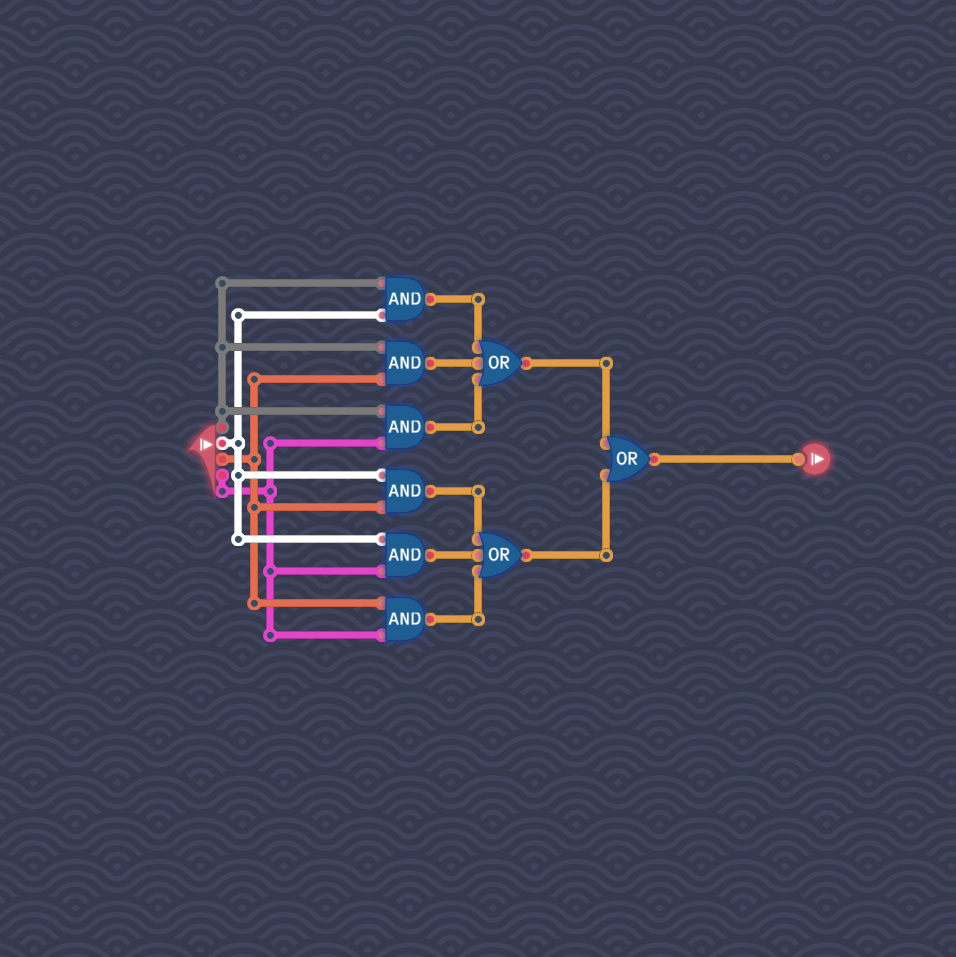

# Double Trouble

There are
$$
  \binom{4}{2} = 6
$$
ways of combining two of the four input signals.
We check for each of these six combinations if both signals are `true` at the same time by using an AND gate.
We then check if at least one of the six AND gates was sucessfull by combining them with OR gates.

We get overall the following circuit:

