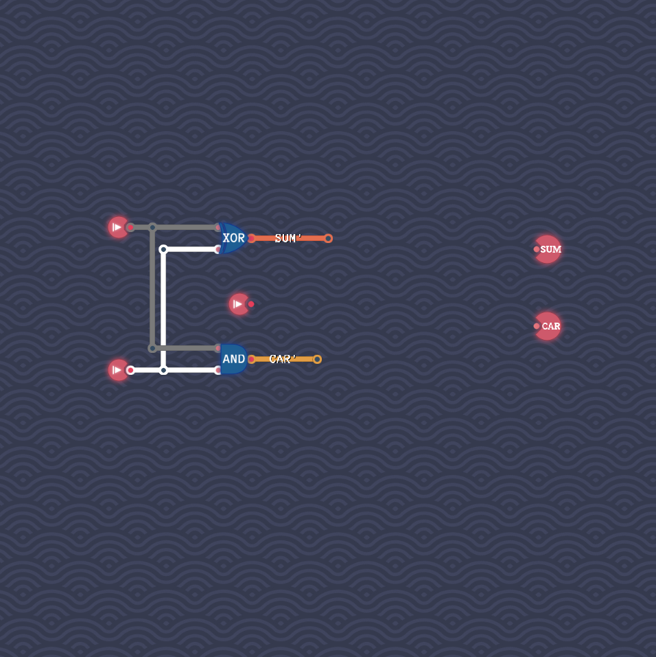
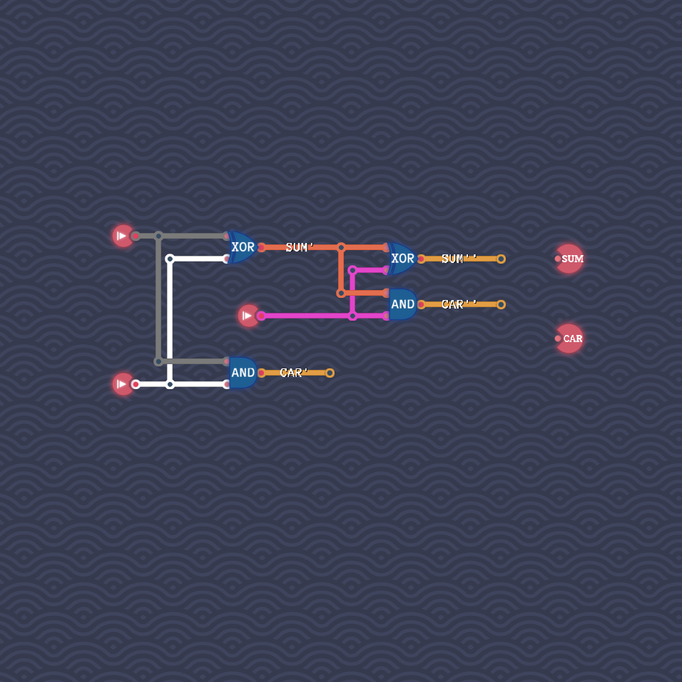
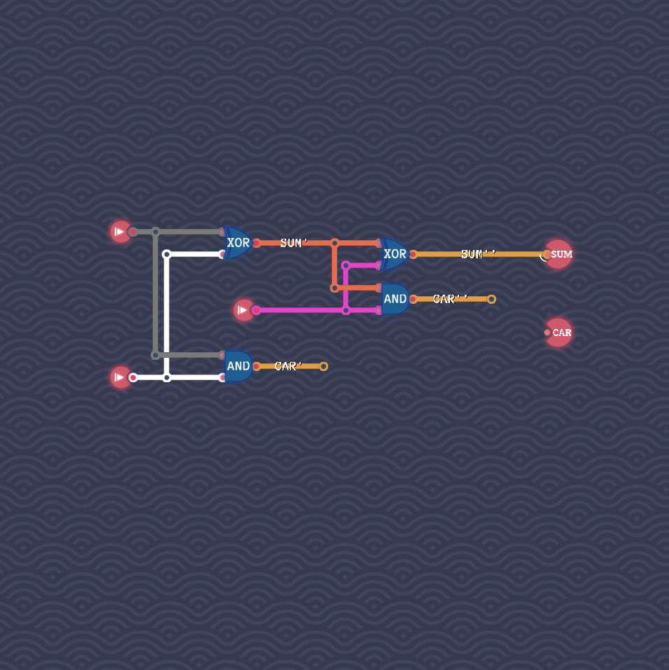
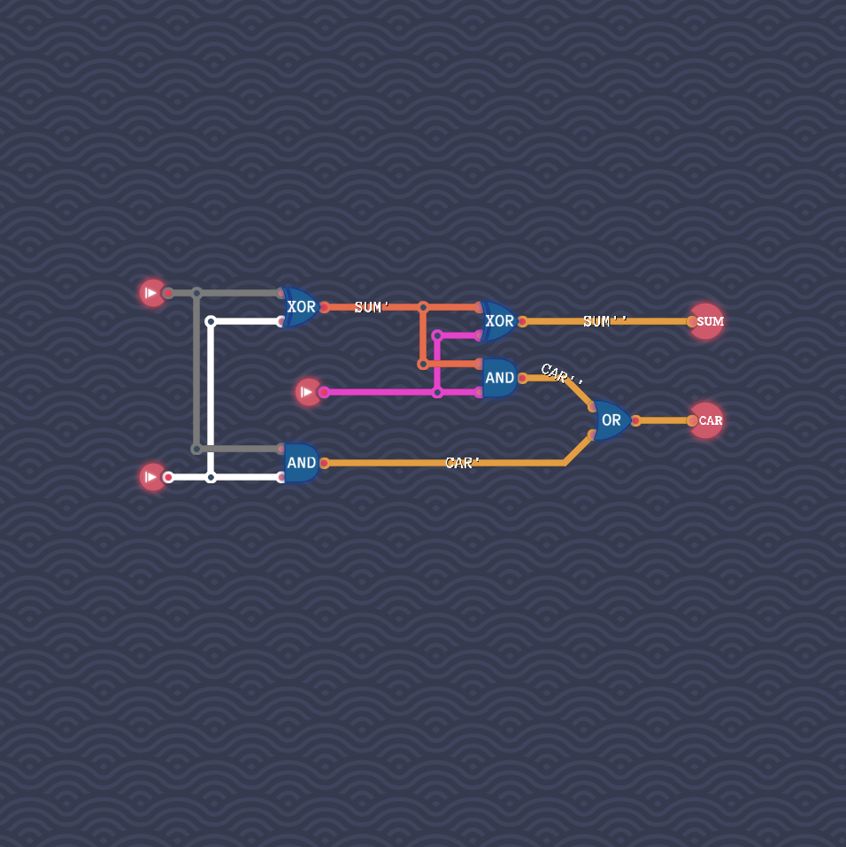

# Full Adder

We will repeatedly use our implementation of a half adder via a XOR gate and an AND gate, as explained in our solution to the level “Half Adder”.
We are going to mimic the way that one would compute the sum of three bits by hand.

We start by adding together two of the three input bits with a half adder.
We get in this way an intermediate sum `SUM'` and a carry `CAR'`.

We add together `SUM'` with the third bit via a second half adder.
This results in another sum `SUM''` and another carry `CAR''`.

The sum `SUM` is simply `SUM''`.

To determine the total carry we check if at least one of the two half adders resulting in a carry.
We do so by combining both carries with an OR gate.
(We do not have to worry about both carries adding up to a higher-order carry, since we are only dealing with three bits.)

