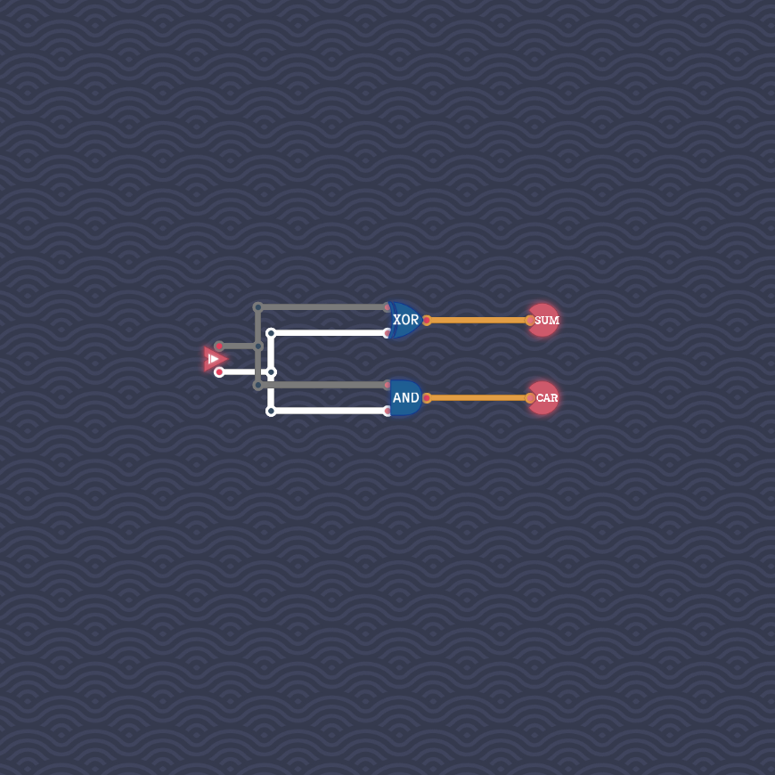

# Half Adder

We can compute the first and second digits separately:

- The first digit is `true` if and only if exactly one of the first two digits is `true`.
  This condition can be checked with a XOR gate.

- The second digit is `true` if and only if both inputs are `true`.
  This condition can be checked with an AND gate.

We arrive at the following circuit:

