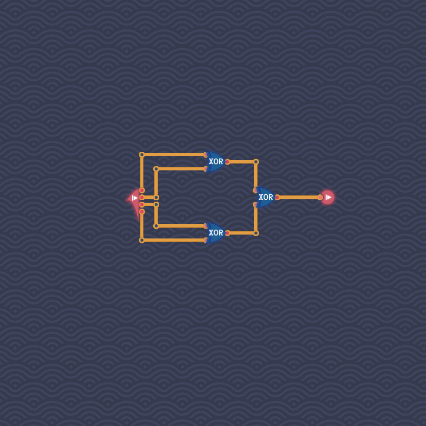

# Odd Number of Signals

The XOR operation is associative, whence we can combine all four inputs via XOR.
Even numbers of `true` inputs cancel out, whence the output is `true` if and only if an odd number of inputs was `true`.
We get the following circuit:

