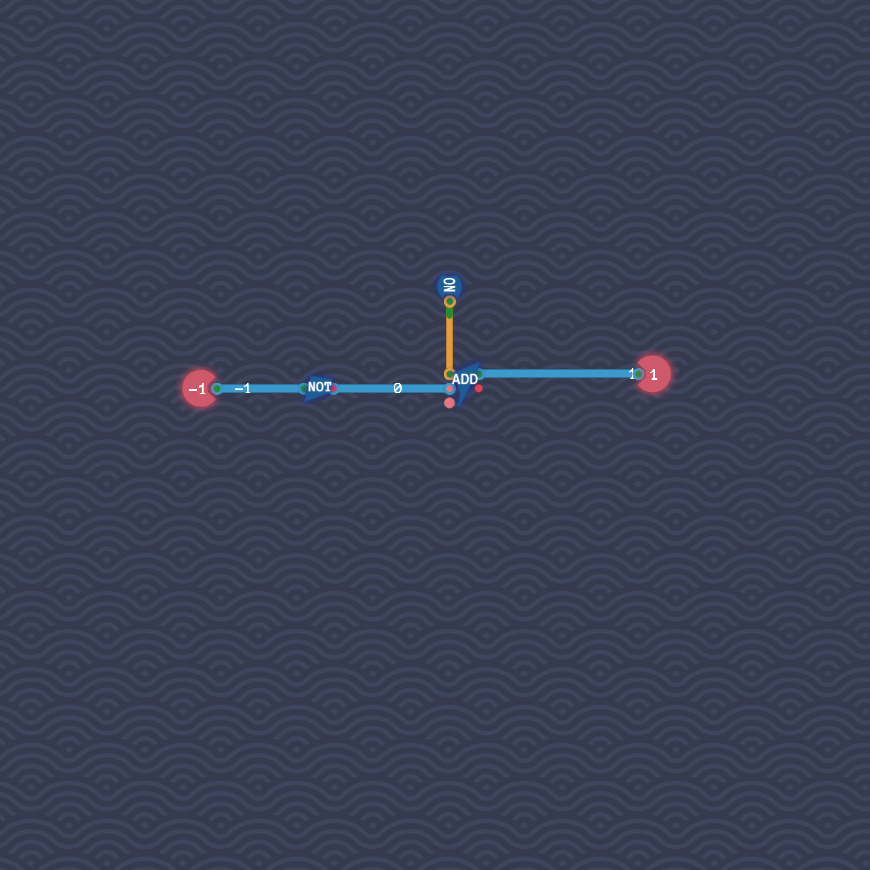

# Signed Negator

Adding together a byte and its bitwise negation always results in the byte whose all bits are 1.
This byte represents the number $-1$.
The bitwise negation of a byte $x$ is thereby the byte $-x - 1$.
We can therefore compute $-x$ by taking the bitwise complement of $x$ and then increment it, i.e., add $1$ to it.

