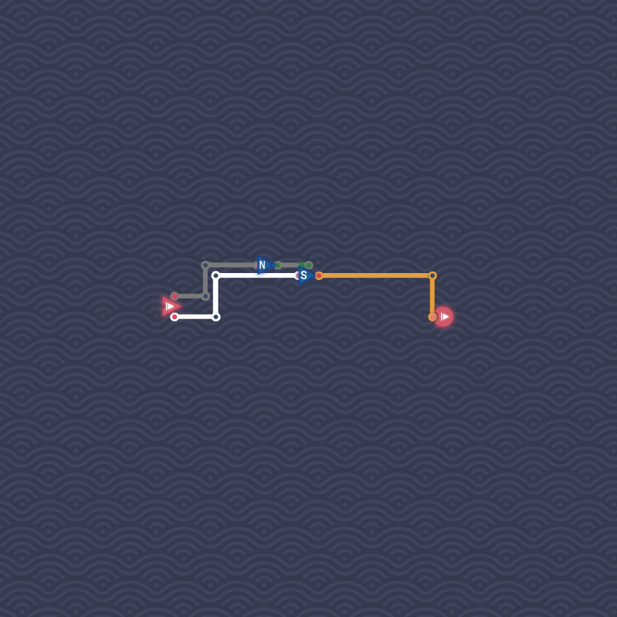
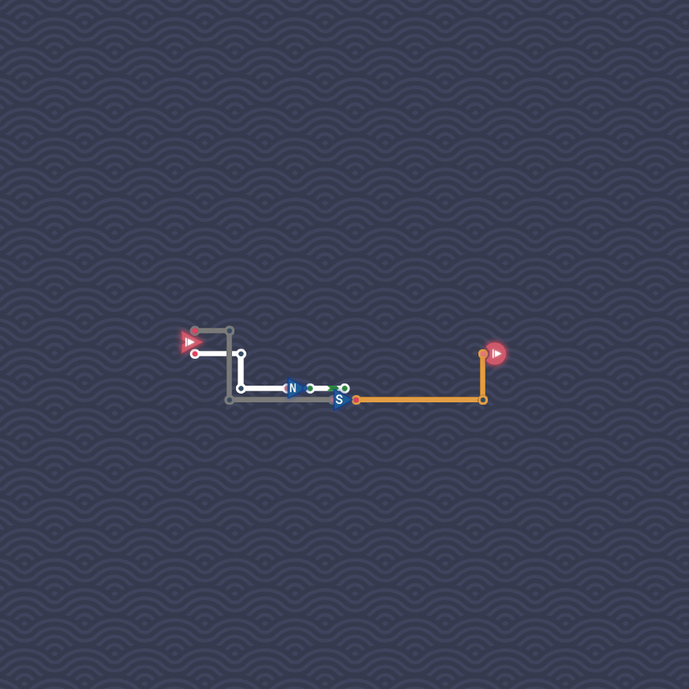
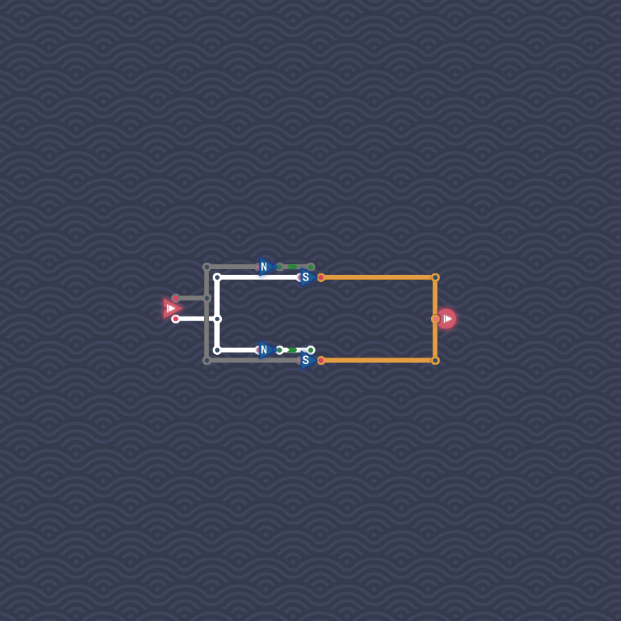

# Bit Switch

If the first input is off, then we want to route the second input to the output:

Similarly, if the second input is off, then we want to route the first input to the output:

This gives us overall the following circuit:

