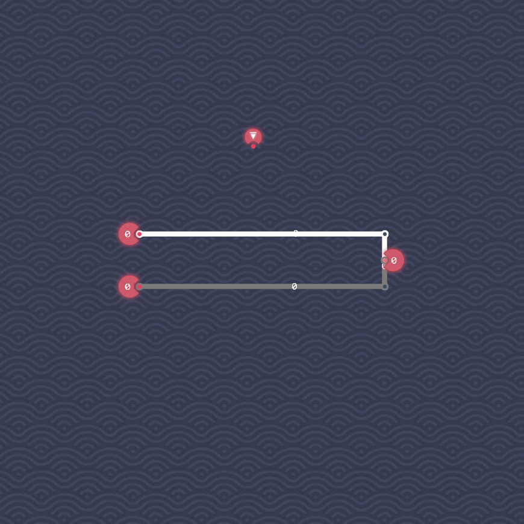
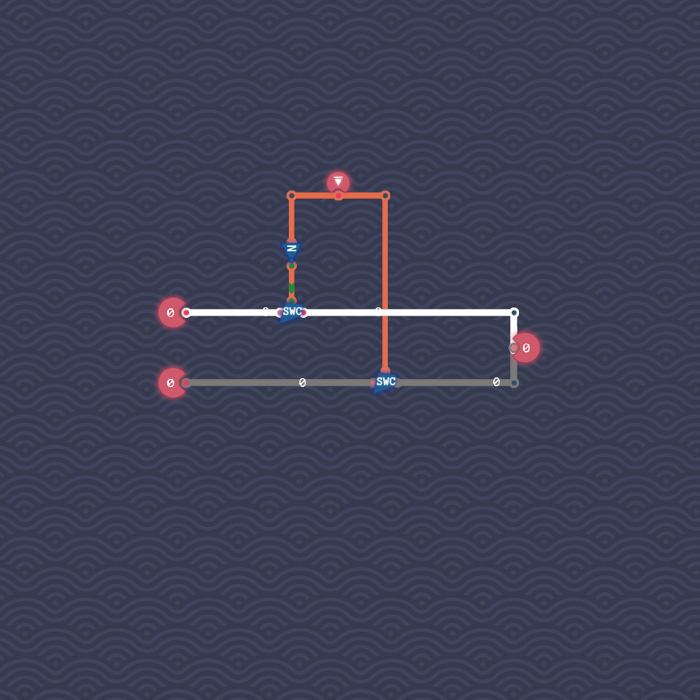

# Input Selector

We first connect both inputs to the output.

We then add a switch to each line.
We connect the input bit to these switches, so that exactly one switch is active at any point in time.
More precisely, we let the first input through if the bit is off, and we let the second input through if the bit is on.

