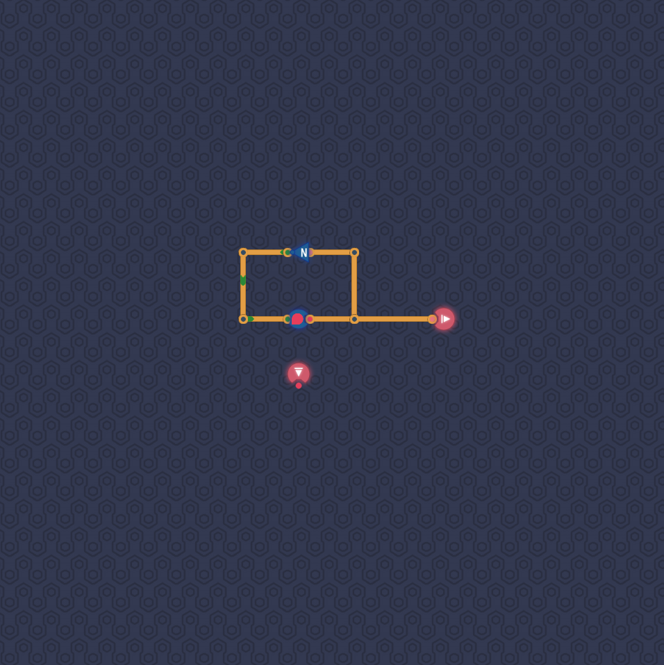

# Odd Ticks

We take the output of a delayed line, negate it, and feed the result back into to delayed line.
This will ensure that the output of the delayed line repeatedly switches between `on` and `off`.
We do not care about the input signal.

