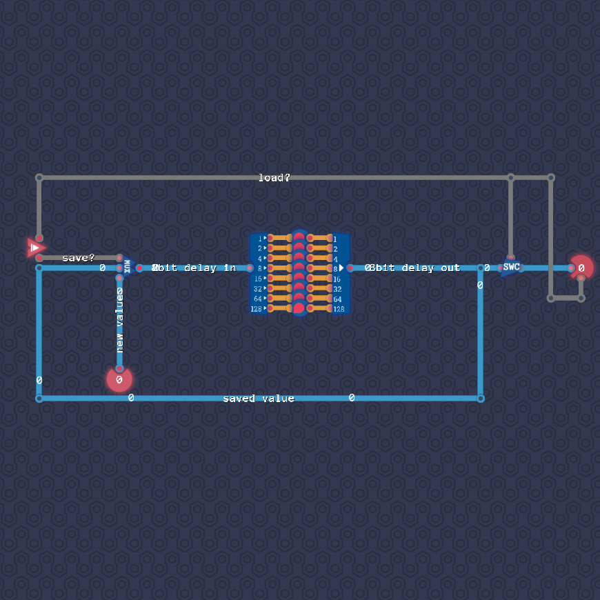

# Saving Bytes

We are overall following the same approach as in “Saving Gracefully”.

We combine eight bit delay lines into a single byte delay line, which we use to store the current value.
We feed this delay line back into itself to remember the current value.

We use a MUX before the delay line to toggle between the current value and a new value.
We also place a switch at the output of the delay line, which controls if the current output of the delay line should be routed to the output component.

