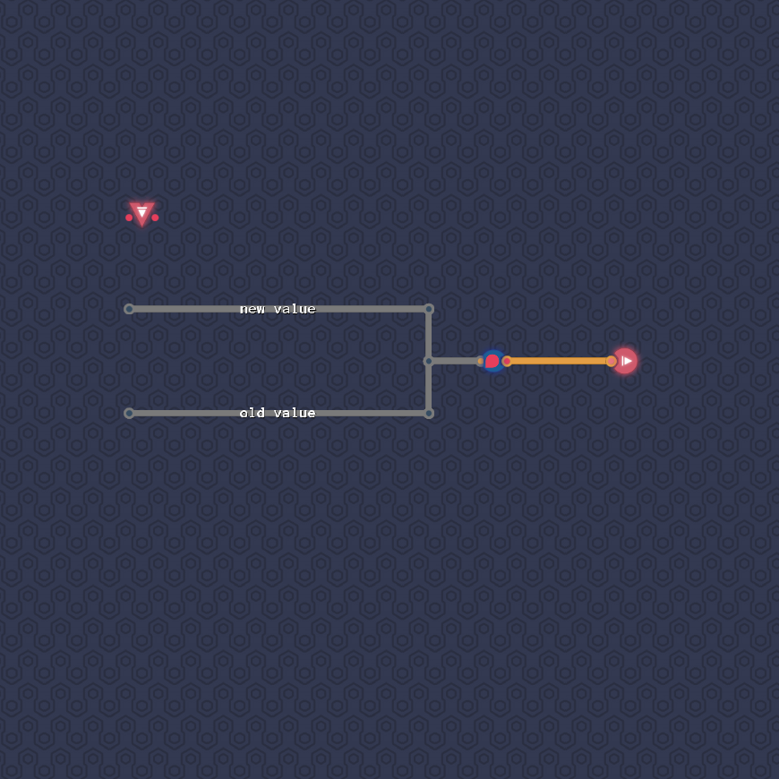
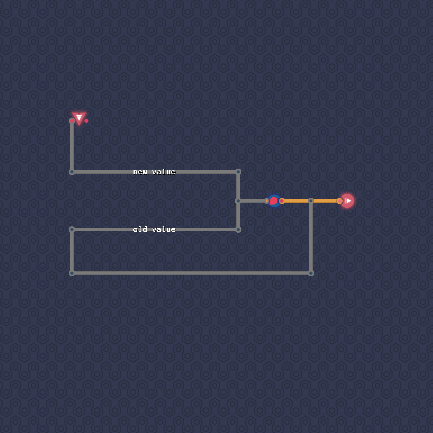
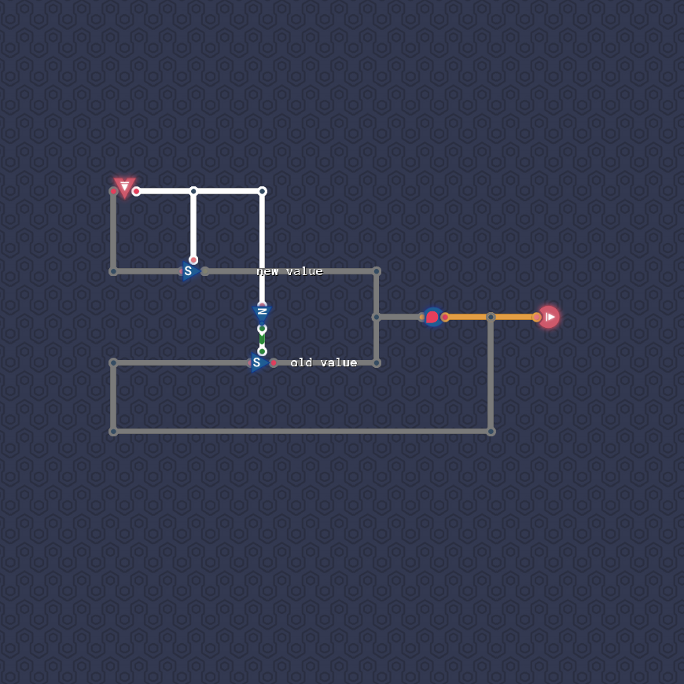

# Saving Gracefully

We will store the saved value in a delayed line.
We will always overwrite this delayed line:
either by a new value, or by the old value.
(So instead of “not changing the saved value” we are “overwriting the saved value with itself”.)

The old value can be read off as the output of the delayed line.
The new value can be read off from the input.

Lastly, we will use the approach from “Input Selector” to route only the correct value into the delayed line.

