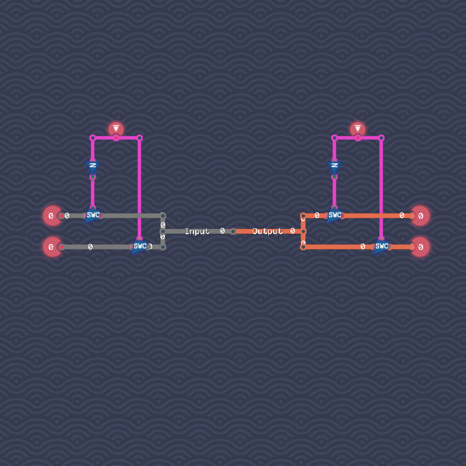

# The Bus

We connect both inputs via the circuit from “Input Selector”.
We then connect the resulting byte with the two outputs via a mirrored version of this circuit.
The first input bit selects with input to use, the second input bits selects which output to use.

